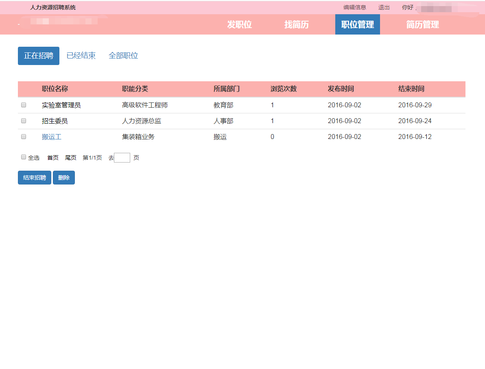

# 人力招聘管理系统

> 可用于毕业设计参考或者个人学习用

- spring+srpingMVC+mybatic+mysql
- jsp

#### 实现功能
- [x] 公司企业负责人/面试者/的登录与登出  
- [x] 公司企业负责人发布岗位，管理岗位
- [x] 公司企业负责人查看邮件，查看简历，转发邮件，下载简历
- [x] 面试者可以搜索岗位，投递简历，管理自己的简历信息

#### 部分截图

# 源码完整版 可加qq：625285133 咨询获取，可一对一专业指定需求，个性化制定代码。
# 后续持续更新新系统，敬请期待！
